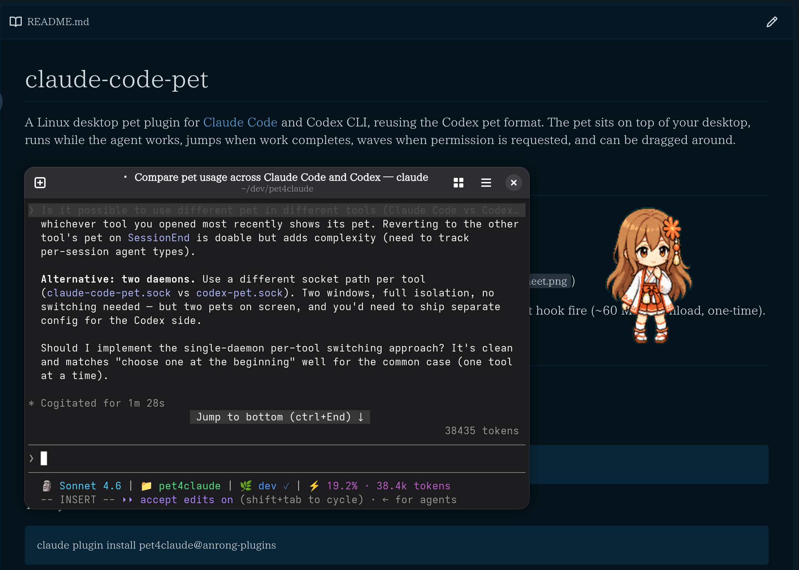

# pet4agents

A Linux desktop pet plugin for [Claude Code](https://claude.com/claude-code) and Codex CLI, reusing the ChatGPT pet format. The pet sits on top of your desktop, runs while the agent works, jumps when work completes, waves when permission is requested, and can be dragged around.

## Why this plugin

ChatGPT pet is playful. However, Claude Code / Desktop does not support it. Codex CLI  supports it while requiring a terminal that supports kitty and have no full functions. Pet4agents implement pet as a plugin.

Play or just watch it when your agent is working!

## Screenshot



## Requirements

- Linux (X11 or native Wayland)
- Python 3.10+ available as `python3` (pip / venv module included)
- A working desktop session (`DISPLAY` or `WAYLAND_DISPLAY`)
- A Codex-format pet at `~/.codex/pets/<pet-id>/` (`pet.json` + `spritesheet.webp` or `spritesheet.png`), v1 or v2

PySide6 `6.11.1` is auto-installed into a private venv at `~/.local/share/pet4agents/venv/` on first hook fire (~60 MB download, one-time). Both the preferred `uv` path and the stdlib `venv` + `pip` fallback install from the repo's hash-pinned `requirements-uv.lock.txt`. The plugin records the expected runtime state there; if a later plugin update changes the pinned dependency set, the lockfile content, or the plugin version, the next `SessionStart` rebuilds that venv before starting the daemon.

## Install

### Claude Code

If you didn't add [my plugin marketplace](https://github.com/xchacha20-poly1305/agent-plugins), add it first.

```shell
claude plugin marketplace add https://github.com/xchacha20-poly1305/agent-plugins.git
```

Then you can install it:

```shell
claude plugin install pet4agents@anrong-plugins
```

Update the plugin:

```shell
claude plugin update pet4agents@anrong-plugins
```

### Codex

Add my plugin marketplace if not have:

```shell
codex plugin marketplace add https://github.com/xchacha20-poly1305/agent-plugins.git
```

Install the plugin:

```shell
codex plugin add pet4agents@anrong-plugins
```

You can also install it from the TUI: launch `codex`, run `/plugins`, pick `pet4agents@anrong-plugins`, and confirm.

Enable `plugin_hooks` feature in `~/.codex/config.toml`:

```toml
[features]
plugin_hooks = true
```

Then trust the hooks in TUI: run `/hooks`, enter each hook, then press `t` to trust.

Update after pulling new changes:

```shell
codex plugin add pet4agents@anrong-plugins
```

#### Behavior difference

Codex hook support is narrower than Claude Code's hook support.

- The pet may appear after the first `SessionStart` hook for a thread, rather than when the `codex` process itself starts.
- Codex provides a root-session `SessionEnd` hook. With `stay_even_no_session: false`, the daemon exits shortly after the last session ends; the PID liveness poll remains the fallback for crashes, `SIGKILL`, or closed terminals.
- Hook config schema differs too: Claude's `hooks/hooks.json` may include a top-level `description`, but Codex's `hooks/codex-hooks.json` must contain only the top-level `hooks` key.

## Behavior

| Agent event            | Pet animation                |
| ---------------------- | ---------------------------- |
| `SessionStart`         | wave once → idle             |
| `UserPromptSubmit`     | running (loop)               |
| `PreToolUse`           | waiting (loop)               |
| `PostToolUse`          | closes the tool's waiting loop |
| `PostToolUseFailure`   | failed once → back to running |
| `Notification`         | review (loop, cleared on next user action) |
| `PermissionRequest`    | waving (loop, cleared on resolution) |
| `PermissionDenied`     | failed once (closes the request) |
| `Elicitation`          | waving (loop, while MCP awaits input) |
| `ElicitationResult`    | closes the elicitation loop  |
| `PreCompact` / `PostCompact` | waiting (loop) during context compaction |
| `SubagentStart`        | review once                  |
| `TaskCreated`          | review once                  |
| `TaskCompleted`        | jump once                    |
| `Stop`                 | jump once → idle             |
| `SubagentStop`         | jump once                    |
| `StopFailure`          | failed once → idle           |
| `SessionEnd`           | wave once → quit if no other sessions remain (override with `stay_even_no_session`) |
| Drag                   | running-right / running-left / jumping based on motion |

## Pet formats (v1 and v2)

Both Codex pet generations work, picked from `spriteVersionNumber` in `pet.json` and verified against the atlas itself:

| Version | Atlas | `spriteVersionNumber` | Extras |
| --- | --- | --- | --- |
| v1 | `1536x1872`, 8 cols × 9 rows | absent or `1` | — |
| v2 | `1536x2288`, 8 cols × 11 rows | `2` | neutral look cell at row 0 / col 6, plus 16 clockwise look directions in rows 9–10 |

The nine animation rows are identical in both, so a v2 pet animates exactly like a v1 one. On top of that, a **v2 pet turns to face your mouse pointer while it is idle**: the pointer direction is mapped to one of 16 cells (22.5° apart, index 0 = straight up, going clockwise), and the neutral cell is used when the pointer sits right on the pet. Tracking stops as soon as the pet has something to do — during a drag, a oneshot flash, or any open interval the animation wins — and beyond `look_radius` the pet goes back to its idle loop. Set `look_at_cursor: false` to turn it off.

If a pet's declared version disagrees with its actual atlas height, the atlas wins and the mismatch is logged to `event.log`.

## Slash commands

- `/pet-stop` — quit the pet daemon
- `/pet-set <pet-id>` — switch to a different pet from `~/.codex/pets/`

## Config

`~/.config/pet4agents/config.json`:

```json
{
  "pet_id": "claude-muse",
  "claude_pet_id": "claude-muse",
  "codex_pet_id": "codex-buddy",
  "stay_even_no_session": false,
  "look_at_cursor": true,
  "look_radius": 600,
  "look_deadzone": 48,
  "max_log_size": 5242880,
  "animation_durations": {
    "idle":          [280, 110, 110, 140, 140, 320],
    "running-right": [120, 120, 120, 120, 120, 120, 120, 220],
    "waving":        [140, 140, 140, 280]
  }
}
```

| Key | Default | Meaning |
| --- | --- | --- |
| `pet_id` | (auto-discover) | Fallback pet folder under `~/.codex/pets/` (or this plugin's `pets/`) when no per-tool ID is set. |
| `claude_pet_id` | `""` | Pet to show when a Claude Code session starts. Reverts to the Codex pet when only Codex sessions remain. Empty = use `pet_id` discovery. |
| `codex_pet_id` | `""` | Pet to show when a Codex session starts. Reverts to the Claude pet when only Claude sessions remain. Empty = use `pet_id` discovery. |
| `stay_even_no_session` | `false` | When `false`, the daemon exits shortly after the last agent session ends. Set to `true` to keep the daemon running until you call `/pet-stop` or ask Codex to stop the pet. The "session ends" check covers the clean `SessionEnd` hook and, when the hook relay found a reliable Claude Code / Codex PID, crashes / `SIGKILL` / terminal close via a 5s liveness poll. If no reliable agent PID is found, the daemon skips PID reaping for that session rather than tracking a short-lived shell wrapper. |
| `look_at_cursor` | `true` | v2 pets only: turn the pet toward the mouse pointer while it is idle. v1 pets have no look rows and ignore this. |
| `look_radius` | `600` | Pointer distance in pixels (from the pet's center) beyond which the pet stops tracking and plays its normal idle loop. |
| `look_deadzone` | `48` | Pointer distance in pixels below which the pet shows the neutral look cell instead of a direction, so it doesn't spin when the pointer rests on it. |
| `max_log_size` | `5242880` | Maximum size in bytes each log file (`event.log`, `install.log`) may reach before automatic truncation. When exceeded, roughly the newest half is kept. Set to `0` to disable truncation (unbounded growth). Default: 5 MiB (5242880). |
| `animation_durations` | `{}` | Per-animation per-frame duration overrides in **milliseconds**. Each value is a list, one entry per frame. Length **must** match the default frame count for that animation (the spritesheet row has a fixed number of cells); mismatched, malformed, or unknown entries are silently ignored. Animation names: `idle`, `running-right`, `running-left`, `waving`, `jumping`, `failed`, `waiting`, `running`, `review` — frame counts: see `scripts/config.py:ANIMATIONS`. JSON is the only entry point; there is no slash command for this. |

Override the pet via env var: `CLAUDE_PET_ID=<id>` or `CODEX_PET_ID=<id>`.

Hook source detection uses the plugin's own `PET4AGENTS_AGENT` command marker plus a process-tree liveness probe. `CLAUDE_PLUGIN_ROOT` alone is not treated as proof of Claude Code, because Codex also sets it for compatibility with Claude plugins.

## Running tests

```bash
uv run --with-requirements requirements-test.txt pytest tests/
```

Or without uv:

```bash
pip install -r requirements-test.txt
python -m pytest tests/
```

## Files / directories used

- venv: `~/.local/share/pet4agents/venv/`
- venv runtime state: `~/.local/share/pet4agents/venv/.pet-runtime.json`
- config: `~/.config/pet4agents/config.json`
- window position: `~/.config/pet4agents/state.json`
- runtime socket: `${XDG_RUNTIME_DIR:-/tmp}/pet4agents.sock`
- log: `~/.local/state/pet4agents/event.log`

## Uninstall

Remove the daemon's runtime files (venv, config, state, socket):

```bash
rm -rf ~/.local/share/pet4agents ~/.config/pet4agents ~/.local/state/pet4agents
rm -f "${XDG_RUNTIME_DIR:-/tmp}/pet4agents.sock"
```

Then remove the plugin from each agent that had it installed.

### Claude Code

```shell
claude plugin uninstall pet4agents@anrong-plugins
```

### Codex CLI

Codex has no `plugin uninstall` CLI subcommand (`codex plugin marketplace remove` only drops a marketplace, not an installed plugin). Uninstall it from the TUI's `/plugins` popup, or do it by hand:

1. Delete the `[plugins."pet4agents@anrong-plugins"]` block from `~/.codex/config.toml`.
2. Drop the cached plugin source:

   ```shell
   rm -rf ~/.codex/plugins/cache/anrong-plugins/pet4agents
   ```

# Privacy Policy

[PRIVACY.md](./PRIVACY.md)

# LICENSE

[MIT](./LICENSE)
